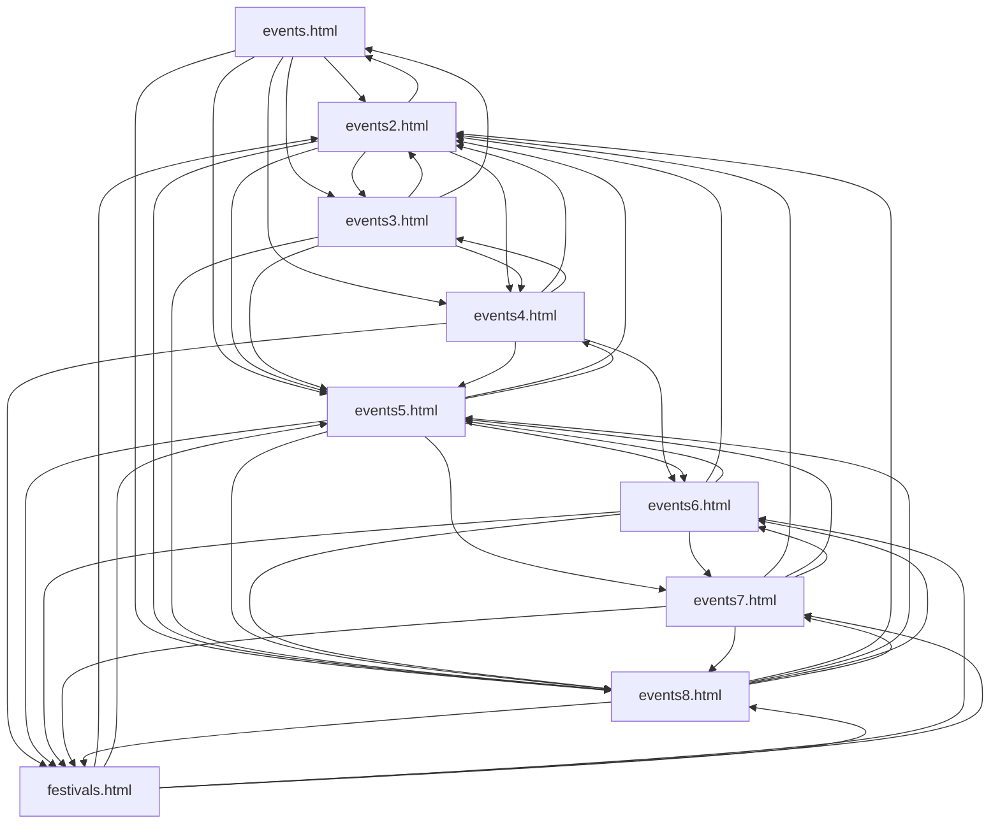
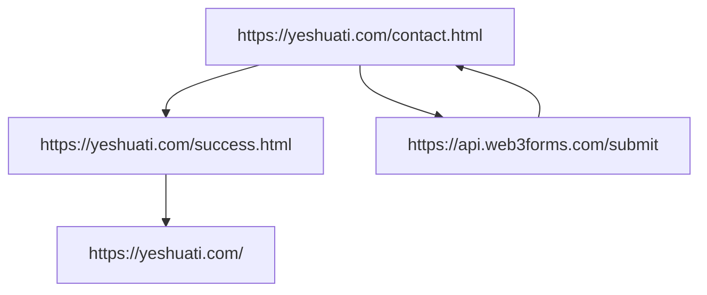

# :star_of_david: T'Shuvah Yisrael

## :place_of_worship: [__Home__](index.html)
[Live Site](https://yeshuati.com)

Upcoming Portions & Festivals

## :menorah: [__About__](about.html)

_incomplete_

Images of Team

Description of Messianic beliefs

## :calendar: [__Events__](events.html)
### Google Calendar
```html
 <!-- Google Calendar
    ================================================== -->
    <p align="center">
        <iframe src="https://calendar.google.com/calendar/embed?src=c_0f07b8a8ee357070580304768fefc555e6ac24da949cf0254ac24eed48dd91a2%40group.calendar.google.com&ctz=America%2FLos_Angeles" style="border: 0" frameborder="0" scrolling="no"></iframe>
    </p>
```
Page Number Navigation Flow Chart

## :information_source: [__Contact__](contact.html)
[Web3Form Settings](https://app.web3forms.com/forms/45ddd0c6-6a04-4847-82e5-e43ad4c7ac83/setup)

Flow Chart


### 404 Page Refresh
```html
<!-- meta refresh page after 5 seconds
    ================================================== -->
    <meta http-equiv="refresh" content="5;url=/"/>
```

## :sparkles: [__Style__](style.html)
### Font Awesome
```html
<!-- fontawesome
    ================================================== -->
    <link rel="stylesheet" href="https://cdnjs.cloudflare.com/ajax/libs/font-awesome/7.0.1/css/all.min.css">
```
### Resized/Repositioned Logo
```html
<!-- header
    ================================================== -->

```

## :copyright: __Copyright__
```html
<div class="column ss-copyright">
<span>© Copyright T'shuvah Yisrael 2025</span>
<span>Design by <a href="https://www.styleshout.com/">StyleShout</a></span>
</div>
```
This is a code bundle for T'Shuvah Yisrael. The original project is available [here](https://www.figma.com/design/un6FWXhTD2JlhdHcHQ1Q20/Church-Website-Creation--Community-).

More directly the Hesed template can be found [here](https://themewagon.com/themes/free-html5-church-website-template-hesed/#:~:text=Hesed%20%2D%20Free%20Responsive%20HTML5%20Church,Iconmonstr%20font%20icons).

[Developed by Isaac V.](https://github.com/vanmeciv/)
---
